# Valkey + Spring Boot

A comprehensive Spring Boot project demonstrating all **Valkey** (Redis alternative) data structures and operations through REST APIs. Includes PostgreSQL for audit logging and Spring Cache abstraction to showcase the performance difference between Valkey (cache) and PostgreSQL (database). All database operations include a **2-second artificial delay** to simulate real-world query latency, making the caching benefit immediately visible.

## Tech Stack

- **Java 25** + **Spring Boot 4.1.1**
- **Valkey 9.1.0** (via Docker) - Redis-compatible in-memory store
- **PostgreSQL 18** (via Docker) - Relational database for audit logs
- **Spring Data Valkey** (with Valkey Glide driver)
- **Spring Data JPA** + Hibernate
- **Spring Cache Abstraction** backed by Valkey
- **Lombok** for boilerplate reduction

## Prerequisites

- Java 25+
- Maven 3.9+
- Docker & Docker Compose

## Quick Start

```bash
# 1. Start infrastructure (Valkey + PostgreSQL)
docker compose up -d

# 2. Verify services are running
docker compose ps

# 3. Run the application
./mvnw spring-boot:run

# 4. Test an endpoint
curl http://localhost:8080/api/server/info
```

The application starts on **http://localhost:8080**.

## Architecture

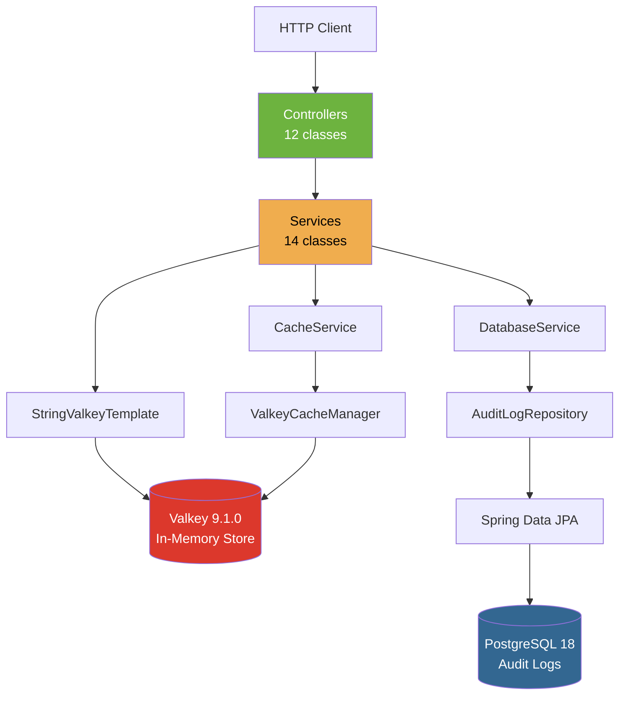

## Project Structure

```
src/main/java/com/sawmik/valkey/
├── ValkeySpringbootApplication.java    # Entry point with @EnableCaching
├── config/
│   ├── CacheConfig.java                # ValkeyCacheManager with JSON serialization
│   └── ValkeyConfig.java              # ValkeyTemplate with Jackson serializers
├── controller/
│   ├── CacheController.java            # Spring cache operations
│   ├── GeoController.java              # Geospatial operations
│   ├── HashController.java             # Hash data type operations
│   ├── HyperLogLogController.java      # Probabilistic counting
│   ├── KeyController.java              # Key management operations
│   ├── ListController.java             # List data type operations
│   ├── ScriptController.java           # Lua script execution
│   ├── ServerController.java           # Server info + audit logs (DB)
│   ├── SetController.java              # Set data type operations
│   ├── SortedSetController.java        # Sorted set operations
│   ├── StreamController.java           # Stream operations
│   └── StringController.java           # String data type operations
├── dto/
│   └── ApiResponse.java                # Uniform API response wrapper
├── entity/
│   └── AuditLog.java                   # JPA entity for audit_log table
├── repository/
│   └── AuditLogRepository.java         # Spring Data JPA repository
└── service/
    ├── CacheService.java               # @Cacheable/@CacheEvict demo
    ├── DatabaseService.java            # Simulated slow DB queries (2s)
    ├── GeoService.java                 # GEOADD, GEODIST, GEOPOS, GEORADIUS
    ├── HashService.java                # HSET, HGET, HGETALL, HINCRBY, etc.
    ├── HyperLogLogService.java         # PFADD, PFCOUNT, PFMERGE
    ├── KeyService.java                 # DEL, EXISTS, EXPIRE, TTL, RENAME, etc.
    ├── ListService.java                # LPUSH, RPUSH, LPOP, RPOP, LRANGE, etc.
    ├── ScriptService.java              # Lua scripts for atomic operations
    ├── SetService.java                 # SADD, SREM, SMEMBERS, SINTER, SUNION, etc.
    ├── SortedSetService.java           # ZADD, ZRANGE, ZRANK, ZSCORE, ZINCRBY
    ├── StreamService.java              # XADD, XREAD, XREADGROUP, XACK
    ├── StringService.java              # SET, GET, APPEND, INCR, STRLEN, etc.
    └── TransactionService.java         # MULTI/EXEC transactions + pipelines
```

## Component Details

### Config Layer

| Class | Purpose |
|-------|---------|
| `CacheConfig` | Creates `ValkeyCacheManager` bean with `JavaTimeModule` for `LocalDateTime` serialization, String key serializer, 10-minute default TTL |
| `ValkeyConfig` | Creates `ValkeyTemplate<String, Object>` with `StringValkeySerializer` for keys and `Jackson2JsonValkeySerializer` for values |

### DTO & Entity Layer

| Class | Purpose |
|-------|---------|
| `ApiResponse` | Uniform response wrapper: `{success, message, data, timestamp}`. Factory methods: `success()`, `error()` |
| `AuditLog` | JPA entity mapped to `audit_log` table. Fields: `id`, `operation`, `entityType`, `entityId`, `details` (TEXT), `createdAt` (auto-generated) |

### Repository Layer

| Class | Purpose |
|-------|---------|
| `AuditLogRepository` | Extends `JpaRepository<AuditLog, Long>`. Provides standard CRUD: `save()`, `findById()`, `findAll()`, `deleteById()`, `count()`, `existsById()` |

### Service Layer

| Class | Valkey Commands | Purpose |
|-------|----------------|---------|
| `StringService` | SET, GET, APPEND, INCR, DECR, SETNX, MGET, STRLEN, BITCOUNT, SETRANGE | String key-value operations |
| `ListService` | LPUSH, RPUSH, LPOP, RPOP, LLEN, LRANGE, LINDEX, LSET, LREM, LTRIM | Linked list operations |
| `HashService` | HSET, HGET, HDEL, HEXISTS, HINCRBY, HGETALL, HKEYS, HVALS, HLEN, HMSET, HSETNX | Field-value map operations |
| `SetService` | SADD, SREM, SMEMBERS, SISMEMBER, SCARD, SRANDMEMBER, SPOP, SINTER, SUNION, SDIFF, SMOVE | Unordered unique set operations |
| `SortedSetService` | ZADD, ZRANGE, ZRANGEBYSCORE, ZRANK, ZSCORE, ZINCRBY, ZREM, ZCARD | Score-ordered set operations |
| `GeoService` | GEOADD, GEODIST, GEOPOS, GEORADIUS, GEOHASH | Geospatial location operations |
| `StreamService` | XADD, XREAD, XGROUP CREATE, XREADGROUP, XACK, XPENDING, XTRIM, XINFO | Append-only log / message queue |
| `HyperLogLogService` | PFADD, PFCOUNT, PFMERGE | Probabilistic cardinality estimation |
| `KeyService` | DEL, EXISTS, EXPIRE, TTL, PERSIST, RENAME, TYPE, KEYS, RANDOMKEY, DUMP, RESTORE | Key-level management |
| `CacheService` | `@Cacheable`, `@CacheEvict` | Spring Cache abstraction demo |
| `ScriptService` | EVAL (Lua scripts) | Atomic operations: increment, compare-and-swap |
| `TransactionService` | MULTI, EXEC, PIPELINE | Transactional and batched commands |
| `DatabaseService` | JPA (PostgreSQL) | Simulated slow queries (2s delay) for audit logging |

### Controller Layer

| Controller | Base Path | Endpoints | Description |
|------------|-----------|-----------|-------------|
| `StringController` | `/api/strings` | 7 | SET, GET, APPEND, INCR, DELETE, LENGTH, CHECK-ABSENT |
| `ListController` | `/api/lists` | 8 | LPUSH, RPUSH, LPOP, RPOP, GET ALL, SIZE, INDEX, DELETE |
| `HashController` | `/api/hashes` | 7 | PUT, GET, ENTRIES, KEYS, SIZE, DELETE, INCREMENT |
| `SetController` | `/api/sets` | 8 | ADD, GET ALL, SIZE, MEMBER CHECK, REMOVE, RANDOM, INTERSECT, UNION |
| `SortedSetController` | `/api/sorted-sets` | 7 | ADD, GET ALL, RANK, SCORE, INCREMENT, RANGE, REMOVE |
| `GeoController` | `/api/geo` | 4 | ADD, POSITION, DISTANCE, RADIUS |
| `StreamController` | `/api/streams` | 5 | ADD, READ, CREATE GROUP, READ GROUP, ACK |
| `HyperLogLogController` | `/api/hyperloglog` | 3 | ADD, COUNT, MERGE |
| `KeyController` | `/api/keys` | 8 | DELETE, EXISTS, EXPIRE, TTL, PERSIST, RENAME, TYPE, SEARCH |
| `ScriptController` | `/api/scripts` | 2 | ATOMIC-INCREMENT, CONDITIONAL-SET |
| `CacheController` | `/api/cache` | 3 | GET (with cache), EVICT, CLEAR ALL |
| `ServerController` | `/api/server` | 5 | INFO, DB-SIZE, FLUSH, AUDIT-LOGS, AUDIT-LOG BY ID |

**Total: 67 endpoints**

## HTTP API Reference

### String Operations

| Method | Endpoint | Body | Description |
|--------|----------|------|-------------|
| `POST` | `/api/strings` | `{"key":"k","value":"v","ttlSeconds":60}` | Set key (optional TTL) |
| `GET` | `/api/strings/{key}` | - | Get value |
| `PUT` | `/api/strings/{key}/append` | `{"value":"v"}` | Append to value |
| `POST` | `/api/strings/{key}/increment` | - | Increment numeric value |
| `DELETE` | `/api/strings/{key}` | - | Delete key |
| `GET` | `/api/strings/{key}/length` | - | Get string length |
| `POST` | `/api/strings/check-absent` | `{"key":"k","value":"v"}` | Set if absent (SETNX) |

### Hash Operations

| Method | Endpoint | Body | Description |
|--------|----------|------|-------------|
| `POST` | `/api/hashes/{key}` | `{"field":"f","value":"v"}` | Set hash field |
| `GET` | `/api/hashes/{key}/{field}` | - | Get field value |
| `GET` | `/api/hashes/{key}/entries` | - | Get all field-value pairs |
| `GET` | `/api/hashes/{key}/keys` | - | Get all field names |
| `GET` | `/api/hashes/{key}/size` | - | Get hash size |
| `DELETE` | `/api/hashes/{key}/{field}` | - | Delete field |
| `PUT` | `/api/hashes/{key}/{field}/increment` | `{"delta":5}` | Increment field value |

### List Operations

| Method | Endpoint | Body | Description |
|--------|----------|------|-------------|
| `POST` | `/api/lists/{key}/left` | `{"value":"v"}` | Push to left (LPUSH) |
| `POST` | `/api/lists/{key}/right` | `{"value":"v"}` | Push to right (RPUSH) |
| `GET` | `/api/lists/{key}/left` | - | Pop from left (LPOP) |
| `GET` | `/api/lists/{key}/right` | - | Pop from right (RPOP) |
| `GET` | `/api/lists/{key}` | - | Get all elements |
| `GET` | `/api/lists/{key}/size` | - | Get list size |
| `GET` | `/api/lists/{key}/{index}` | - | Get element at index |
| `DELETE` | `/api/lists/{key}` | - | Delete entire list |

### Set Operations

| Method | Endpoint | Body | Description |
|--------|----------|------|-------------|
| `POST` | `/api/sets/{key}` | `{"values":["a","b"]}` | Add members |
| `GET` | `/api/sets/{key}` | - | Get all members |
| `GET` | `/api/sets/{key}/size` | - | Get set size |
| `GET` | `/api/sets/{key}/member/{value}` | - | Check membership |
| `DELETE` | `/api/sets/{key}/member/{value}` | - | Remove member |
| `POST` | `/api/sets/{key}/random` | - | Pop random member |
| `POST` | `/api/sets/intersect` | `{"keys":["s1","s2"]}` | Intersection |
| `POST` | `/api/sets/union` | `{"keys":["s1","s2"]}` | Union |

### Sorted Set Operations

| Method | Endpoint | Body | Description |
|--------|----------|------|-------------|
| `POST` | `/api/sorted-sets/{key}` | `{"member":"a","score":10}` | Add with score |
| `GET` | `/api/sorted-sets/{key}` | - | Get all members |
| `GET` | `/api/sorted-sets/{key}/rank/{member}` | - | Get rank |
| `GET` | `/api/sorted-sets/{key}/score/{member}` | - | Get score |
| `POST` | `/api/sorted-sets/{key}/increment/{member}` | `{"delta":5}` | Increment score |
| `GET` | `/api/sorted-sets/{key}/range?min=0&max=100` | - | Range by score |
| `DELETE` | `/api/sorted-sets/{key}/member/{member}` | - | Remove member |

### Geo Operations

| Method | Endpoint | Body | Description |
|--------|----------|------|-------------|
| `POST` | `/api/geo/{key}` | `{"member":"city","longitude":139.69,"latitude":35.69}` | Add location |
| `GET` | `/api/geo/{key}/position/{member}` | - | Get position |
| `GET` | `/api/geo/{key}/distance/{member1}/{member2}` | - | Distance between (km) |
| `GET` | `/api/geo/{key}/radius?longitude=...&latitude=...&radius=100&unit=km` | - | Radius search |

### Stream Operations

| Method | Endpoint | Body | Description |
|--------|----------|------|-------------|
| `POST` | `/api/streams/{name}` | `{"key":"val"}` | Add message |
| `GET` | `/api/streams/{name}` | - | Read all messages |
| `POST` | `/api/streams/{name}/group/{group}` | - | Create consumer group |
| `POST` | `/api/streams/{name}/group/{group}/read` | `{"consumer":"c1"}` | Read from group |
| `POST` | `/api/streams/{name}/group/{group}/ack` | `{"recordIds":["..."]}` | Acknowledge messages |

### HyperLogLog Operations

| Method | Endpoint | Body | Description |
|--------|----------|------|-------------|
| `POST` | `/api/hyperloglog/{key}/add` | `{"values":["a","b"]}` | Add elements |
| `GET` | `/api/hyperloglog/{key}/count` | - | Approximate count |
| `POST` | `/api/hyperloglog/merge` | `{"destKey":"d","sourceKeys":["s1","s2"]}` | Merge HLLs |

### Key Operations

| Method | Endpoint | Body | Description |
|--------|----------|------|-------------|
| `DELETE` | `/api/keys/{key}` | - | Delete key |
| `GET` | `/api/keys/{key}/exists` | - | Check existence |
| `POST` | `/api/keys/{key}/expire` | `{"seconds":60}` | Set expiry |
| `GET` | `/api/keys/{key}/ttl` | - | Get TTL |
| `POST` | `/api/keys/{key}/persist` | - | Remove TTL |
| `POST` | `/api/keys/rename` | `{"oldKey":"a","newKey":"b"}` | Rename key |
| `GET` | `/api/keys/{key}/type` | - | Get key type |
| `GET` | `/api/keys/search?pattern=*` | - | Search by pattern |

### Script Operations

| Method | Endpoint | Body | Description |
|--------|----------|------|-------------|
| `POST` | `/api/scripts/atomic-increment` | `{"key":"k"}` | Lua: atomic INCR+GET |
| `POST` | `/api/scripts/conditional-set` | `{"key":"k","expectedValue":"old","newValue":"new"}` | Lua: compare-and-swap |

### Cache Operations

| Method | Endpoint | Body | Description |
|--------|----------|------|-------------|
| `GET` | `/api/cache/{key}` | - | Get from cache (miss = 2s DB sim) |
| `DELETE` | `/api/cache/{key}` | - | Evict single entry |
| `DELETE` | `/api/cache/all` | - | Clear entire cache |

### Server Operations

| Method | Endpoint | Body | Description |
|--------|----------|------|-------------|
| `GET` | `/api/server/info` | - | Valkey server INFO |
| `GET` | `/api/server/db-size` | - | Number of keys |
| `POST` | `/api/server/flush` | - | FLUSHALL (dangerous) |
| `GET` | `/api/server/audit-logs` | - | All audit logs (2s delay) |
| `GET` | `/api/server/audit-logs/{id}` | - | Audit log by ID (2s delay) |

## Performance: Cache vs Database

The project demonstrates the dramatic performance difference between Valkey (in-memory cache) and PostgreSQL (disk-based database) by simulating a 2-second delay on all database operations.

| Operation | Source | Response Time | Notes |
|-----------|--------|--------------|-------|
| All Valkey data operations | **Valkey** | **8-50ms** | In-memory, sub-millisecond actual |
| Cache HIT | **Valkey** | **~10ms** | Cached value returned instantly |
| Cache MISS (first call) | **PostgreSQL** | **~2,000ms** | Simulated 2s DB delay |
| Audit logs query | **PostgreSQL** | **~2,000ms** | Simulated 2s DB delay |

### Response Time Breakdown

```
Valkey Operations (in-memory):  ~10-50ms total
├── Network round-trip:         ~5-10ms
├── Command execution:          ~1-5ms (actual)
└── Serialization:              ~2-5ms

PostgreSQL Operations (simulated):  ~2,000ms total
├── Network round-trip:              ~1-2ms
├── Simulated query delay:           ~2,000ms
└── Serialization:                   ~5-10ms
```

### Cache Flow

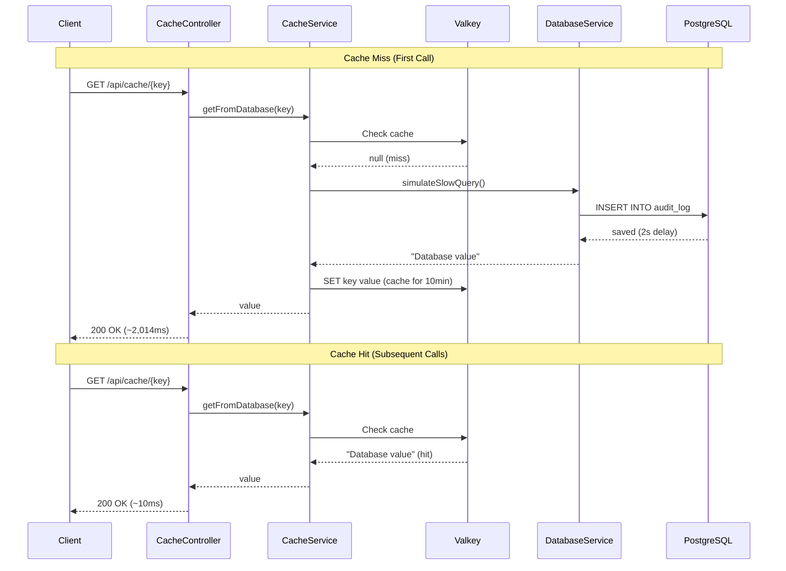

## Data Structure Flow Diagrams

### String Operations Flow

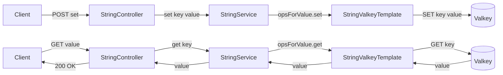

### Hash Operations Flow

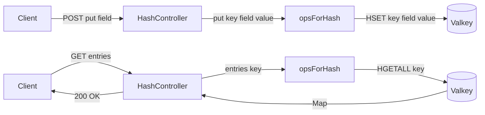

### List Operations Flow

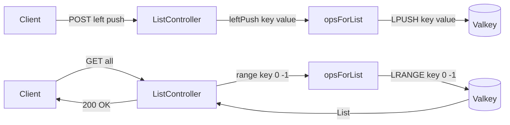

### Set Operations Flow

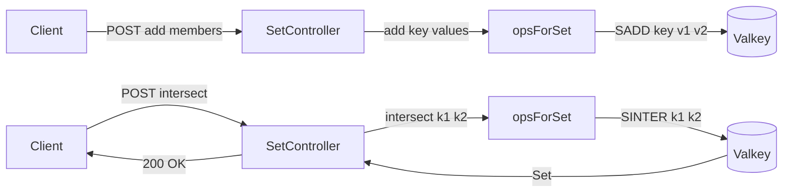

### Sorted Set Operations Flow

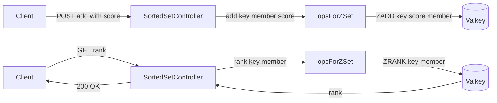

### Geo Operations Flow

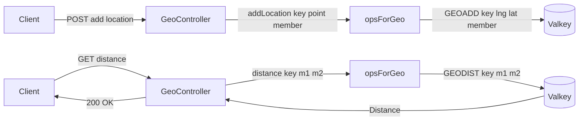

### Stream Operations Flow

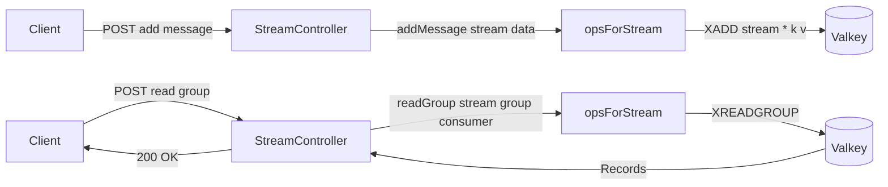

### HyperLogLog Operations Flow

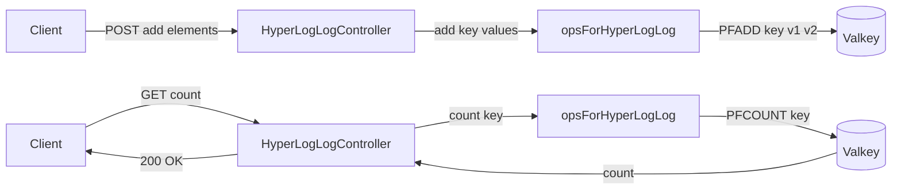

### Script Lua Operations Flow

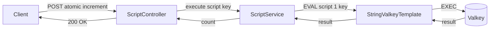

### Cache Operations Flow

```mermaid
flowchart LR
    A[Client] -->|GET cache| B[CacheController]
    B -->|getFromDatabase key| C[CacheService]
    C -->|@Cacheable check| D{Valkey Cache}
    D -->|HIT| C
    D -->|MISS| E[DatabaseService]
    E -->|simulateSlowQuery 2s| F[(PostgreSQL)]
    F -->|AuditLog| E
    E -->|value| C
    C -->|cache value| D
    C -->|value| B
    B -->|200 OK| A
```

### Key Management Flow

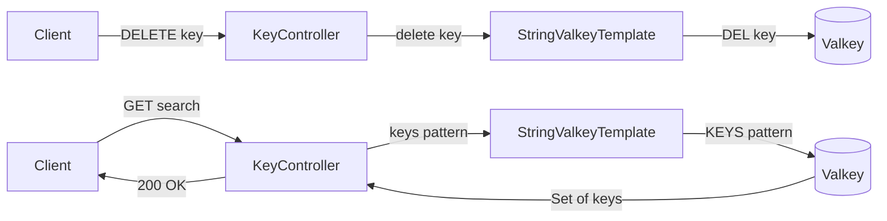

### Server and Audit Log Flow

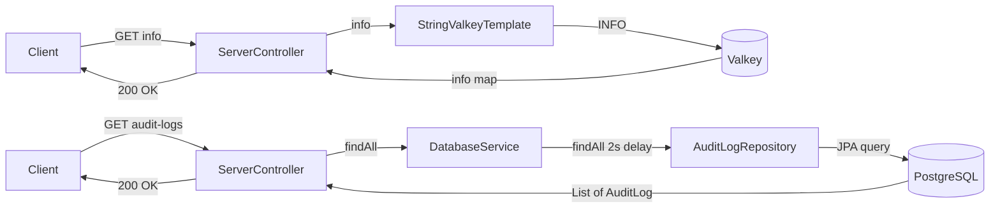

## Full Request Lifecycle

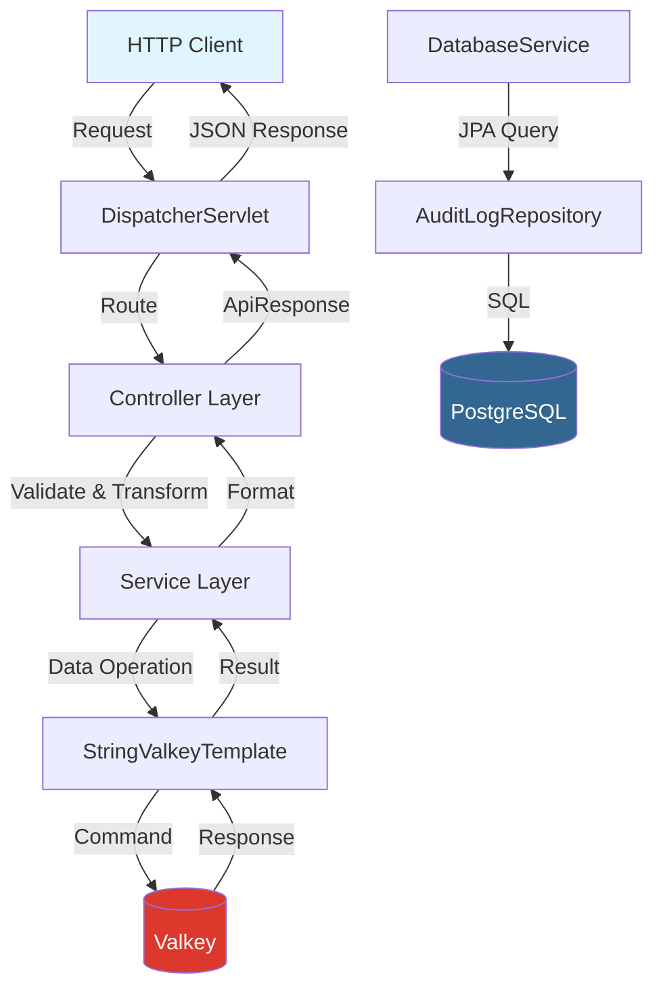

## Docker Compose Services

| Service | Image | Port | Purpose |
|---------|-------|------|---------|
| `valkey` | `valkey/valkey:9.1.0` | `6379` | In-memory data store (Redis alternative) |
| `postgres` | `postgres:18` | `5432` | Relational DB for audit logs |

```bash
# Start all services
docker compose up -d

# Check status
docker compose ps

# View logs
docker compose logs -f valkey
docker compose logs -f postgres

# Stop all services
docker compose down

# Stop and remove volumes (data loss)
docker compose down -v
```

## License

This project is licensed under the MIT License - see the [LICENSE](LICENSE) file for details.
